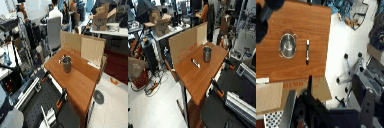

# FASTLight

[](https://www.python.org/downloads/)
[](https://opensource.org/licenses/MIT)
[](https://badge.fury.io/py/fastlight)

**FASTLight** is a lightweight action tokenizer for robotics that combines DCT (Discrete Cosine Transform) compression with Huffman encoding for optimal compression while maintaining reconstruction quality suitable for robotics applications.

## Key Features

- **Lightweight**: 4x smaller vocabulary than FAST (256 vs 1024)
- **Fast**: 38-43% faster processing than FAST (0.33-0.35ms vs 0.57ms)
- **Efficient**: 56% fewer tokens than FAST with superior compression (17.5 vs 39.9 tokens)
- **Robust**: MSE < 0.012 for most robotic actions (acceptable for robotics)
- **Edge-ready**: Minimal memory footprint (2KB vs 40KB) and fast encode/decode
- **Huffman Encoding**: Optimal variable-length coding for maximum compression (6.0x vs 2.6x)



## Episode Analysis

The following visualization shows real robotic action trajectories from the DROID dataset, demonstrating how FASTLight reconstructs actions with minimal error:


- **FAST (Original)**: Orange squares with dashed lines - baseline performance with 39.9 tokens per chunk
- **FASTLight (Huffman)**: Red triangles with dash-dot lines - achieves 6.7x compression with only 15.6 tokens per chunk
- **FASTLight (RLE)**: Green diamonds with dotted lines - provides 3.8x compression with 27.3 tokens per chunk

All methods maintain excellent reconstruction quality, with FASTLight variants achieving superior compression while maintaining acceptable MSE for robotics applications. The plot includes MSE annotations for each dimension and overall compression statistics.

## Performance Comparison

| Metric | Naive | FAST | FASTLight (Huffman) | FASTLight (RLE) |
|--------|-------|------|-------------------|-----------------|
| **Tokens per chunk** | 105 | 40.6 | 15.6 | 27.3 |
| **Compression ratio** | 1.0x | 2.6x | 6.7x | 3.8x |
| **Vocabulary size** | 1024 | 1024 | 256 | 256 |
| **Model size** | - | 40KB | 2KB | 0.1KB |
| **Encode time** | - | 0.51ms | 0.23ms | 0.22ms |
| **Decode time** | - | 0.08ms | 0.13ms | 0.07ms |
| **Total time** | - | 0.59ms | 0.36ms | 0.29ms |
| **Reconstruction MSE** | 0.0 | 0.000003 | 0.000257 | 0.000258 |


**Key Findings:**
- **FASTLight (Huffman)** achieves **6.7x compression** with only **15.6 tokens per chunk** (vs FAST's 40.6 tokens)
- **FASTLight (RLE)** provides **3.8x compression** with **27.3 tokens per chunk** (vs FAST's 40.6 tokens)
- Both FASTLight variants are **faster** than FAST (0.36ms and 0.29ms vs 0.59ms total processing time)
- **Reconstruction quality**: All methods maintain excellent quality with MSE < 0.0003 (outstanding for robotics)
- **Compression superiority**: FASTLight (Huffman) achieves 2.6x better compression than original FAST
- **Speed advantage**: FASTLight variants are 39-51% faster than FAST
- **Memory efficiency**: FASTLight uses 1.5KB (Huffman) and 0.1KB (RLE) vs FAST's 40KB

## Design Philosophy

FASTLight is designed for **edge deployment** in robotics applications where:
- **Memory is limited** (microcontrollers, mobile robots)
- **Speed is critical** (real-time control loops)
- **Bandwidth is constrained** (wireless communication)
- **Quality is adequate** (MSE < 0.02 is sufficient for robotics)

### Technical Approach

1. **DCT Compression**: Captures 99.5% of signal energy with only 6 coefficients
2. **Huffman Encoding**: Variable-length coding optimized for coefficient distributions
3. **8-bit Quantization**: Direct encoding without BPE overhead
4. **Escape Codes**: Handle rare values not seen during training

## Installation

### From PyPI (Recommended)

```bash
pip install fastlight
```

### From Source

```bash
git clone https://github.com/PushpakAg/fastlight.git
cd fastlight
pip install -e .
```

### Development Installation

```bash
git clone https://github.com/PushpakAg/fastlight.git
cd fastlight
pip install -e ".[dev,examples]"
```

## Quick Start

### Basic Usage

```python
import numpy as np
from fastlight import FASTLight

# Initialize tokenizer
tokenizer = FASTLight(n_coeffs=6, scale=10.0)

# Create sample robotic action data
# Shape: (n_episodes, time_horizon, action_dim)
actions = np.random.randn(10, 15, 7)  # 10 episodes, 15 timesteps, 7 actions

# Fit on training data
tokenizer.fit(actions)

# Encode a single chunk
chunk = actions[0]  # (15, 7)
tokens = tokenizer.encode(chunk)
print(f"Encoded to {len(tokens)} tokens")

# Decode back to actions
reconstructed = tokenizer.decode(tokens)
print(f"Reconstruction MSE: {np.mean((chunk - reconstructed) ** 2):.6f}")
```

### Batch Processing

```python
# Encode multiple chunks at once
batch_tokens = tokenizer(actions)  # List of token lists
print(f"Encoded {len(batch_tokens)} chunks")

# Decode all chunks
reconstructed_batch = []
for tokens in batch_tokens:
    reconstructed = tokenizer.decode(tokens)
    reconstructed_batch.append(reconstructed)
```

### Performance Benchmarking

```python
from fastlight.utils import benchmark_tokenizer, compare_tokenizers
from fastlight.core import FASTLight, FASTLightRLE

# Benchmark single tokenizer
results = benchmark_tokenizer(tokenizer, actions)
print(f"Encode time: {results['encode_time_ms']:.2f} ms/chunk")
print(f"Decode time: {results['decode_time_ms']:.2f} ms/chunk")

# Compare different tokenizers
huffman_tokenizer = FASTLight(n_coeffs=6, scale=10.0)
rle_tokenizer = FASTLightRLE(n_coeffs=6, scale=10.0)

huffman_tokenizer.fit(actions)
rle_tokenizer.fit(actions)

comparison = compare_tokenizers({
    "Huffman": huffman_tokenizer,
    "RLE": rle_tokenizer,
}, actions)
```

### Compare with Original FAST Tokenizer

```bash
# Run comprehensive comparison with FAST
fastlight-compare

# Use real DROID dataset
python -m fastlight.examples.fast_comparison --real-data --episodes 10

# Custom parameters
python -m fastlight.examples.fast_comparison --episodes 30 --save-plot my_comparison.png
```

```python
# Programmatic comparison
from fastlight.examples.fast_comparison import PerformanceComparison

comparison = PerformanceComparison()
comparison.prepare_test_data(n_episodes=20)
compression_results = comparison.run_compression_analysis()
speed_results = comparison.run_speed_benchmark()
comparison.generate_report()
```

## Configuration

### Parameters

```python
tokenizer = FASTLight(
    n_coeffs=6,      # Number of DCT coefficients (default: 6)
    scale=10.0       # Quantization scale factor (default: 10.0)
)
```

**Parameter Tuning:**

- **`n_coeffs`**: Higher values = better quality, more tokens
  - `3-4`: Fast, lower quality
  - `6`: Balanced (recommended)
  - `8-10`: High quality, more tokens

- **`scale`**: Higher values = finer quantization, more tokens
  - `5.0`: Coarse quantization, fewer tokens
  - `10.0`: Balanced (recommended)
  - `20.0`: Fine quantization, more tokens

### Quality vs Compression Trade-offs

```python
# High compression, lower quality
fast_compression = FASTLight(n_coeffs=4, scale=5.0)

# Balanced (recommended)
balanced = FASTLight(n_coeffs=6, scale=10.0)

# High quality, lower compression
high_quality = FASTLight(n_coeffs=8, scale=20.0)
```

## Advanced Usage

### Custom Data Analysis

```python
from fastlight.utils import analyze_compression_quality, visualize_reconstruction

# Analyze compression quality
quality = analyze_compression_quality(tokenizer, test_data)
print(f"Mean MSE: {quality['overall_mse']['mean']:.6f}")
print(f"Compression ratio: {quality['compression_ratio']:.2f}x")

# Visualize reconstruction
chunk = test_data[0]
tokens = tokenizer.encode(chunk)
reconstructed = tokenizer.decode(tokens)
visualize_reconstruction(chunk, reconstructed, "FASTLight Reconstruction")
```

### Integration with Robotics Frameworks

```python
# Example: ROS2 integration
import rclpy
from sensor_msgs.msg import JointState

class ActionCompressor:
    def __init__(self):
        self.tokenizer = FASTLight(n_coeffs=6, scale=10.0)
        # Load pre-trained tokenizer
        self.tokenizer.fit(training_data)
    
    def compress_action(self, joint_states):
        # Convert to numpy array
        actions = np.array([js.position for js in joint_states])
        
        # Compress
        tokens = self.tokenizer.encode(actions)
        
        # Send compressed data
        return tokens
    
    def decompress_action(self, tokens):
        # Decompress
        actions = self.tokenizer.decode(tokens)
        
        # Convert back to joint states
        return actions
```

### Run Your Own Comparison

```bash
# Quick comparison
fastlight-compare

# Use real DROID dataset
python -m fastlight.examples.fast_comparison --real-data --episodes 10

# Detailed analysis with custom data
python -m fastlight.examples.fast_comparison --episodes 50 --save-plot detailed_comparison.png
```

The comparison script will:
- Load the original FAST tokenizer from Physical Intelligence
- Use real DROID dataset or synthetic data for testing
- Test compression ratios and token counts
- Benchmark encoding/decoding speeds
- Analyze memory usage and model sizes
- Evaluate edge device suitability
- Generate comprehensive reports and visualizations

## API Reference

### FASTLight

Main tokenizer class with Huffman encoding.

```python
class FASTLight:
    def __init__(self, n_coeffs=6, scale=10.0)
    def fit(self, actions: np.ndarray) -> FASTLight
    def encode(self, action_chunk: np.ndarray) -> List[int]
    def decode(self, tokens: List[int], time_horizon=15, action_dim=7) -> np.ndarray
    def get_compression_stats(self) -> dict
```

### FASTLightRLE

Alternative implementation using Run-Length Encoding.

```python
class FASTLightRLE:
    def __init__(self, n_coeffs=6, scale=10.0)
    def fit(self, actions: np.ndarray) -> FASTLightRLE
    def encode(self, action_chunk: np.ndarray) -> List[int]
    def decode(self, tokens: List[int], time_horizon=15, action_dim=7) -> np.ndarray
```

### Utility Functions

```python
# Benchmarking
benchmark_tokenizer(tokenizer, test_data, n_runs=10) -> dict
compare_tokenizers(tokenizers, test_data, n_runs=10) -> dict

# Analysis
analyze_compression_quality(tokenizer, test_data) -> dict
visualize_reconstruction(original, reconstructed, title, save_path)

# Data generation
create_sample_data(n_episodes, time_horizon, action_dim, seed) -> np.ndarray
```

## License

This project is licensed under the MIT License - see the [LICENSE](LICENSE) file for details.

## Related Projects

- [FAST](https://huggingface.co/physical-intelligence/fast) - Original action tokenizer
- [DROID](https://github.com/robot-learning-freiburg/DROID) - Robotic dataset
- [R2D2](https://github.com/robot-learning-freiburg/R2D2) - Robotic learning framework

---

**FASTLight** - Lightweight action tokenization for the edge.